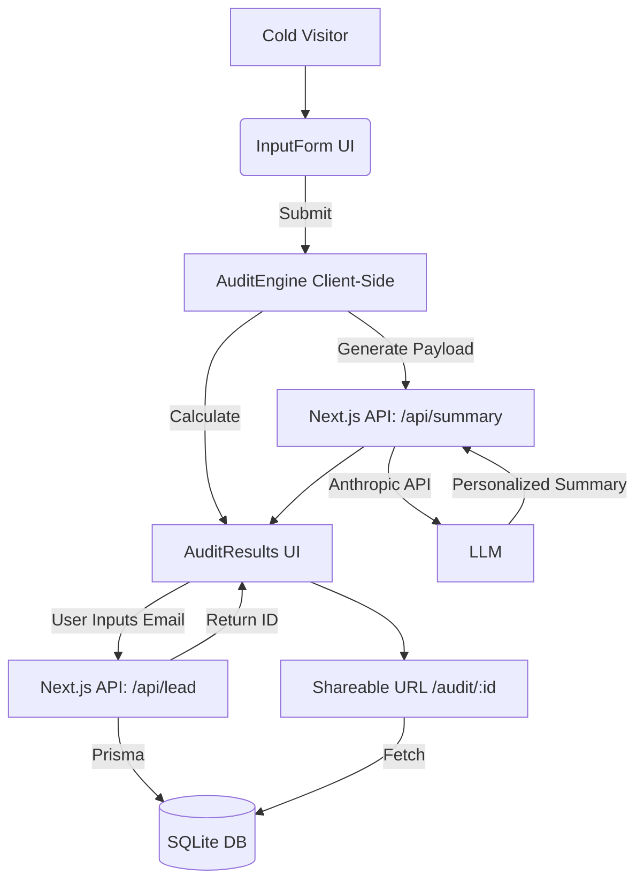

# Architecture

## System Diagram

## Data Flow

1. The user inputs their AI tool subscriptions, team size, and use case into the client-side form (`InputForm.tsx`).
2. Upon submission, the payload is immediately processed by `auditEngine.ts`, which applies hardcoded logic rules to identify savings.
3. Concurrently, a POST request is sent to `/api/summary` with the calculated report, which queries the Anthropic API to generate a personalized summary.
4. The user views the completed `AuditReport`. If they choose to save/share it, they submit their email.
5. A POST request is sent to `/api/lead`, where Prisma saves the report JSON to the `Audit` table and links it to a new `Lead` entry.
6. A public, anonymized URL (`/audit/[id]`) is generated, which pulls only the `Audit` data from the DB for sharing.

## Stack Justification

- **Next.js (App Router)**: Eliminates the need for a separate backend. Perfect for a quick, full-stack MVP.
- **TypeScript**: Ensures the `AuditReport` and `ToolSubscription` shapes remain consistent across the client UI, API routes, and database.
- **Tailwind CSS**: Rapid styling with maximum flexibility for the brutalist aesthetic.
- **Prisma**: Type-safe database queries. Using SQLite locally allows for zero-setup execution, easily swappable to PostgreSQL in production.

## Scaling to 10k audits/day

If this had to handle 10k audits per day:
1. **Edge Caching**: I would move the shareable `/audit/[id]` routes to use Edge networking and heavily cache them using standard Next.js revalidation.
2. **Database**: Swap SQLite for a highly available Postgres instance (e.g., Supabase or Neon).
3. **Queueing**: The email-sending trigger and LLM summary generation would be moved to background jobs (e.g., Inngest or Upstash Kafka) to avoid blocking the main server threads and handle API rate limits gracefully.
