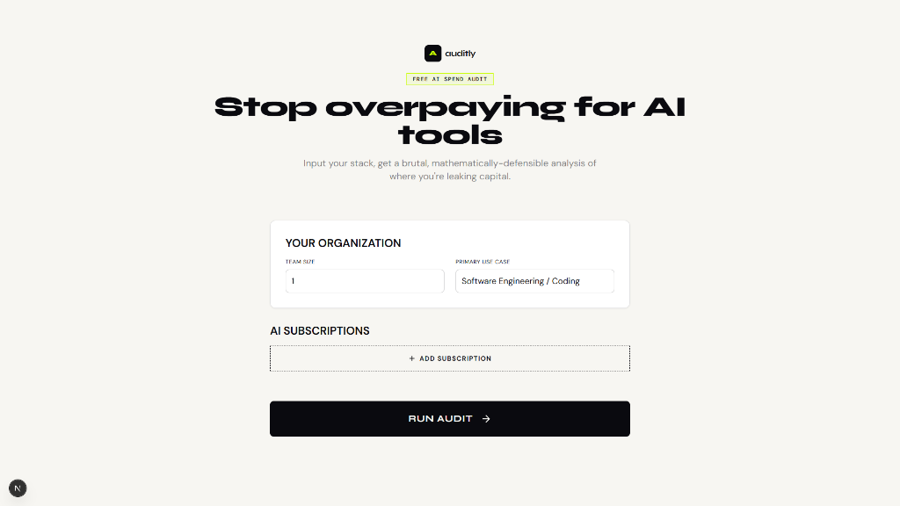
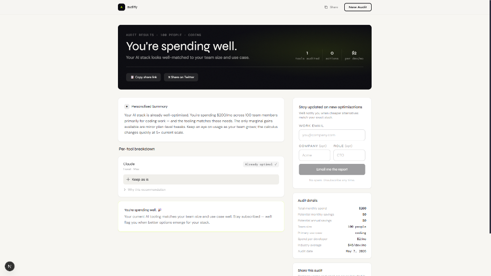
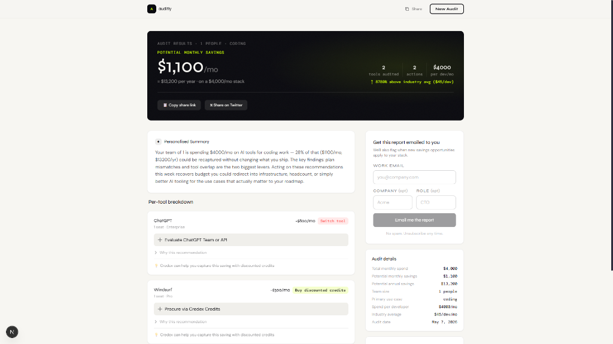

# AI Spend Audit

**Live App:** [https://ai-spend-audit.vercel.app](https://ai-spend-audit.vercel.app)

AI Spend Audit is a brutal, mathematically defensible tool for engineering managers and startup founders to analyze their AI infrastructure stack (Cursor, Copilot, Claude, ChatGPT, etc.) and instantly identify wasted capital from sub-optimal plans.

## Screenshots

### Homepage — Input Your Stack


### Results — Optimally Spending


### Results — Savings Detected


## Quick Start

```bash
# 1. Install dependencies
npm install

# 2. Generate Prisma client
npx prisma generate

# 3. Run the dev server
npm run dev
```

Open [http://localhost:3000](http://localhost:3000) in your browser.

## Tech Stack

| Layer | Technology |
|---|---|
| Framework | Next.js 16 (App Router, Turbopack) |
| Language | TypeScript (strict mode) |
| Styling | Tailwind CSS v4 with `@theme` design tokens |
| Database | Prisma 7 + PostgreSQL (via pg adapter) |
| Fonts | Syne, DM Sans, DM Mono (Google Fonts) |
| Testing | Jest + Testing Library |

## Architecture

```
src/
├── app/
│   ├── page.tsx                    # Homepage with audit form
│   ├── layout.tsx                  # Root layout with fonts + SEO
│   ├── globals.css                 # Design system (Tailwind v4 @theme)
│   ├── api/
│   │   ├── audit/route.ts          # POST — run audit + save to DB
│   │   ├── summary/route.ts        # POST — generate CFO-style summary
│   │   ├── lead/route.ts           # POST — lead capture with honeypot
│   │   └── og/route.ts             # GET — dynamic OG image (SVG)
│   └── audit/[id]/
│       ├── page.tsx                # Server component — loads audit from DB
│       └── AuditResultsClient.tsx  # Client component — polished results UI
├── components/
│   ├── InputForm.tsx               # Tool/plan/spend input form
│   └── AuditResults.tsx            # Legacy results component
├── lib/
│   ├── auditEngine.ts              # Core audit logic (rule engine)
│   ├── audit.ts                    # Adapter — enriches engine output
│   ├── supabase.ts                 # DB layer (Prisma wrapper)
│   ├── ratelimit.ts                # In-memory rate limiter
│   ├── email.ts                    # Transactional email via Resend
│   └── types.ts                    # Core domain types
└── types/
    └── index.ts                    # AuditResult + ToolRecommendation types
```

## Key Decisions

1. **Next.js App Router** — SSR, API routes, and zero-config Vercel deployment in one framework.
2. **Prisma 7 + PostgreSQL** — Robust persistence via Postgres. The `supabase.ts` abstraction manages the database connection logic using the Prisma pg adapter.
3. **Templated AI Summaries** — CFO-style personalized summaries without requiring an API key. Drop in an Anthropic key for AI-generated ones.
4. **Tailwind v4 @theme** — Custom design tokens (`paper`, `ink`, `acid`) instead of generic colors, creating a premium editorial aesthetic.
5. **Honeypot over CAPTCHA** — Frictionless lead capture that silently catches bots without hurting conversion.
6. **Rate Limiting** — In-memory sliding-window limiter on all API routes (per-IP and per-email).

## Testing

See [TESTS.md](TESTS.md) for details on the unit test coverage.

```bash
npm test           # 5 audit engine unit tests
npx tsc --noEmit   # Type check
npm run build      # Production build
```

## Documentation

See the [`docs/`](docs/) directory for:
- [Architecture](docs/ARCHITECTURE.md)
- [Pricing Data](docs/PRICING_DATA.md)
- [Prompts](docs/PROMPTS.md)
- [GTM Strategy](docs/GTM.md)
- [Economics](docs/ECONOMICS.md)
- [Dev Log](docs/DEVLOG.md)
- [Reflection](docs/REFLECTION.md)


## Website link
https://ai-spend-audit-psi.vercel.app/
